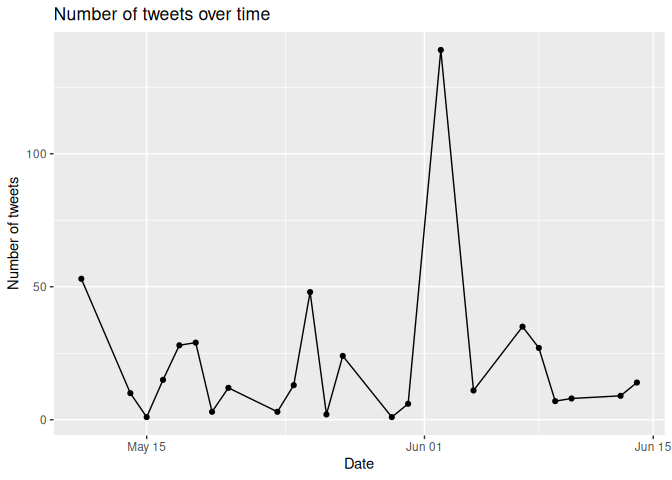

# Lecture 10: String manipulation
Romain Ferrali

``` r
suppressPackageStartupMessages(library(tidyverse))
df <- read_csv("./data/lecture-10-tweets.csv", show_col_types = FALSE)
```

``` r
df # a dataset about tweets, with information about the user who posted the tweet the content of the tweet
```

    # A tibble: 498 × 4
       date                         topic   handle       text                       
       <chr>                        <chr>   <chr>        <chr>                      
     1 Mon May 11 03:17:40 UTC 2009 kindle2 tpryan       @stellargirl I loooooooovv…
     2 Mon May 11 03:18:03 UTC 2009 kindle2 vcu451       Reading my kindle2...  Lov…
     3 Mon May 11 03:18:54 UTC 2009 kindle2 chadfu       Ok, first assesment of the…
     4 Mon May 11 03:19:04 UTC 2009 kindle2 SIX15        @kenburbary You'll love yo…
     5 Mon May 11 03:21:41 UTC 2009 kindle2 yamarama     @mikefish  Fair enough. Bu…
     6 Mon May 11 03:22:00 UTC 2009 kindle2 GeorgeVHulme @richardebaker no. it is t…
     7 Mon May 11 03:22:30 UTC 2009 aig     Seth937      Fuck this economy. I hate …
     8 Mon May 11 03:26:10 UTC 2009 jquery  dcostalis    Jquery is my new best frie…
     9 Mon May 11 03:27:15 UTC 2009 twitter PJ_King      Loves twitter              
    10 Mon May 11 03:29:20 UTC 2009 obama   mandanicole  how can you not love Obama…
    # ℹ 488 more rows

# Main functions for working with strings

- `grepl()`: returns a logical vector indicating whether a pattern is
  found in a string
- `gsub()`: replaces all occurrences of a pattern in a string with a
  replacement
- `substr()`: returns a substring of a string, given a starting and
  ending position
- `nchar()`: returns the number of characters in a string
- `sprintf()`: formats a string using a template and values
- `paste()`: concatenates strings together, with a separator

You can use other functions, such as `str_detect()` and
`str_replace_all()` from the `stringr` package. I don’t like them.

An important thing to note is that these functions use **regular
expressions**, which are a powerful way to specify patterns in strings.
Regular expressions are a very strange language, but they are the very
useful for working with strings. This is where AI shines. My
recommendations are:

1.  Use the main text functions (e.g., `grepl()`, `gsub()`) to do simple
    string manipulation tasks, such as checking if a string contains a
    certain word, or replacing a certain word with another word,
    **always** disabling regular expressions.
2.  Use specialized packages to work with specific types of strings,
    such as URLs, email addresses, etc. For example, the `lubridate`
    package is great for working with dates and times.
3.  Use AI to write functions that use regular expressions to do more
    complex string manipulation tasks. For example, you can ask AI to
    write a function that extracts the domain name from a URL, or that
    checks if a string is a valid email address. Make sure to test the
    function on a variety of inputs to ensure that it works correctly.
    In fact, you should provide these inputs as examples when asking AI
    to write the function, to make sure that it works correctly on those
    examples.

# Simple string lookup task: find the mention tweets

There’s one simple task we might want to do with the tweets: find the
ones that mention other users. There is a very basica approach to this:
find tweets that contain the “@” symbol.

``` r
df |>
  filter(
    grepl(
      "@", # look for the "@" symbol,
      text, # in column "text"
      fixed = TRUE # and disable regular expressions
      # (i.e., treat "@" as a literal character, not a special character in regular expressions)
    )
    # grepl() returns a logical vector:
    # if the "@" symbol is found in the text,
    # it returns TRUE, otherwise it returns FALSE.
    # The filter() function keeps only the rows where the condition is TRUE.
  )
```

    # A tibble: 114 × 4
       date                         topic   handle         text                     
       <chr>                        <chr>   <chr>          <chr>                    
     1 Mon May 11 03:17:40 UTC 2009 kindle2 tpryan         @stellargirl I loooooooo…
     2 Mon May 11 03:19:04 UTC 2009 kindle2 SIX15          @kenburbary You'll love …
     3 Mon May 11 03:21:41 UTC 2009 kindle2 yamarama       @mikefish  Fair enough. …
     4 Mon May 11 03:22:00 UTC 2009 kindle2 GeorgeVHulme   @richardebaker no. it is…
     5 Mon May 11 03:32:48 UTC 2009 obama   kylesellers    @Karoli I firmly believe…
     6 Mon May 11 05:06:22 UTC 2009 nike    vincentx24x    dear nike, stop with the…
     7 Mon May 11 05:21:37 UTC 2009 lebron  ursecretdezire @ludajuice Lebron is a B…
     8 Mon May 11 05:21:45 UTC 2009 lebron  Native_01      @Pmillzz lebron IS THE B…
     9 Mon May 11 05:22:03 UTC 2009 lebron  princezzcutz   @sketchbug Lebron is a h…
    10 Mon May 11 05:22:37 UTC 2009 lebron  emceet         @wordwhizkid Lebron is a…
    # ℹ 104 more rows

The problem with this approach is that it will return false positives,
such as tweets that contain an email address (e.g., “Hello I’m
rferrali@example.com”). We could make this a bit more robust: a handle
is

- a **word** (i.e., white space + text + white space) that
- starts with “@”
- does not contain any other “@” symbols

Let’s write a function that checks if a string contains a handle, using
this more robust definition.

``` r
# some test data
tweets <- c(
  "Hello @friend, how are you?", # TRUE
  "Hello", # FALSE
  # edge cases that should be ruled out
  "Hello I'm rferrali@gmail.com", # FALSE
  "Hello @ngr@man", # FALSE
  "Hello @ngr@man and @friend" # TRUE
)

# prompt: return a function that checks if a string contains a handle,
# where a handle is defined as a word that starts with "@"
# and does not contain any other "@" symbols.
# The function should return TRUE if the string contains a handle, and FALSE otherwise.

# after some back and forth with AI, we get the following function:
# the strange characters are regex (short for regular expression) language... yuk!
# notice how we use the fixed = TRUE argument in the previous example to disable regex
# here we don't use it, because we want to use regex.
has_handle <- function(text) {
  grepl("(^|[^a-zA-Z0-9])@[a-zA-Z0-9_]+($|[^a-zA-Z0-9@])", text)
}

has_handle(tweets)
```

    [1]  TRUE FALSE FALSE FALSE  TRUE

# Strings through other packages: working with dates

We want to extract the year from the `date` variable.

## Approach 1: extract the year using string manipulation

Say we want to extract the year from the `date` variable using string
manipulation. We can do this by looking at the structure of the date
string and using the `substr()` function to extract the relevant part of
the string.

``` r
# in this dataset, the year is always the last 4 characters of the date string
head(year)
```

                           
    1 function (x)         
    2 {                    
    3     UseMethod("year")
    4 }                    

``` r
df |>
  mutate(
    # we can use the substr() function to extract the last 4 characters of the date string
    # substr stands for "substring", and it takes three arguments:
    # the string, the starting position, and the ending position
    # substr(date, 1, 3) would extract characters 1 to 3 (so the first three characters)
    # now, we want to extract the last 4 characters
    # nchar() stands for "number of characters", and it returns the number of characters in a string
    # so nchar(date) - 3 returns the position of the fourth-to-last character,
    # and nchar(date) returns the position of the last character
    # this way, we extract the last 4 characters of the date string, which is the year
    year = substr(date, nchar(date) - 3, nchar(date)),
    # we convert the year to a numeric variable, so that we can do calculations with it
    year = as.numeric(year)
  )
```

    # A tibble: 498 × 5
       date                         topic   handle       text                   year
       <chr>                        <chr>   <chr>        <chr>                 <dbl>
     1 Mon May 11 03:17:40 UTC 2009 kindle2 tpryan       @stellargirl I loooo…  2009
     2 Mon May 11 03:18:03 UTC 2009 kindle2 vcu451       Reading my kindle2..…  2009
     3 Mon May 11 03:18:54 UTC 2009 kindle2 chadfu       Ok, first assesment …  2009
     4 Mon May 11 03:19:04 UTC 2009 kindle2 SIX15        @kenburbary You'll l…  2009
     5 Mon May 11 03:21:41 UTC 2009 kindle2 yamarama     @mikefish  Fair enou…  2009
     6 Mon May 11 03:22:00 UTC 2009 kindle2 GeorgeVHulme @richardebaker no. i…  2009
     7 Mon May 11 03:22:30 UTC 2009 aig     Seth937      Fuck this economy. I…  2009
     8 Mon May 11 03:26:10 UTC 2009 jquery  dcostalis    Jquery is my new bes…  2009
     9 Mon May 11 03:27:15 UTC 2009 twitter PJ_King      Loves twitter          2009
    10 Mon May 11 03:29:20 UTC 2009 obama   mandanicole  how can you not love…  2009
    # ℹ 488 more rows

## Approach 2: extract the year using the lubridate package

Another option is to use the `lubridate` package, which is designed for
working with dates and times. Usually, it’s much easier to use a
specialized package for working with dates, rather than trying to
manipulate the date strings directly. For common date formattings,
`lubridate` works out of the box.

``` r
# easy to use, and it recognizes the date format automatically
dates <- c("2021/01/01", "2022/02/02", "2023/03/03")
as_date(dates)
```

    [1] "2021-01-01" "2022-02-02" "2023-03-03"

``` r
# but in this dataset, the date format is not recognized by lubridate, so we get NA values
as_date(head(df$date))
```

    Warning: 3 failed to parse.

    [1] NA           "2011-03-18" NA           "2011-03-19" NA          
    [6] "2011-03-22"

Here, we’re dealing with a more rare formatting that `lubridate` doesn’t
recognize by default, so we need to specify the format of the date
string `parse_date_time` function. The format string is a combination of
letters that represent different parts of the date and time. For
example, “Y” represents the year, “m” represents the month, “d”
represents the day, “H” represents the hour, “M” represents the minute,
and “S” represents the second. The other characters (e.g., “a”, “b”)
represent other parts of the date string that we want to ignore (e.g.,
the day of the week, the month name).

``` r
parse_date_time(
  head(df$date),
  # this format string tells lubridate how to parse the date string:
  # a = abbreviated weekday name (e.g., "Mon", "Tue", etc.)
  # b = abbreviated month name (e.g., "Jan", "Feb", etc.)
  # d = day of the month (e.g., "01", "02", etc.)
  # H = hour (e.g., "00", "01", etc.)
  # M = minute (e.g., "00", "01", etc.)
  # S = second (e.g., "00", "01", etc.)
  # for more information on the format string,
  # see ?parse_date_time
  "a b d H:M:S Y"
)
```

    [1] "2009-05-11 03:17:40 UTC" "2009-05-11 03:18:03 UTC"
    [3] "2009-05-11 03:18:54 UTC" "2009-05-11 03:19:04 UTC"
    [5] "2009-05-11 03:21:41 UTC" "2009-05-11 03:22:00 UTC"

## A nice plot: tweets over time

Now that we have the date variable in a format that we can work with, we
can create a nice plot of the number of tweets over time.

``` r
df |>
  mutate(
    date = parse_date_time(date, "a b d H:M:S Y"),
    date = as_date(date) # we only care about the date, not the time
  ) |>
  group_by(date) |>
  summarize(n = n()) |>
  ggplot(aes(x = date, y = n)) +
  geom_line() +
  geom_point() +
  labs(
    title = "Number of tweets over time",
    x = "Date",
    y = "Number of tweets"
  )
```


