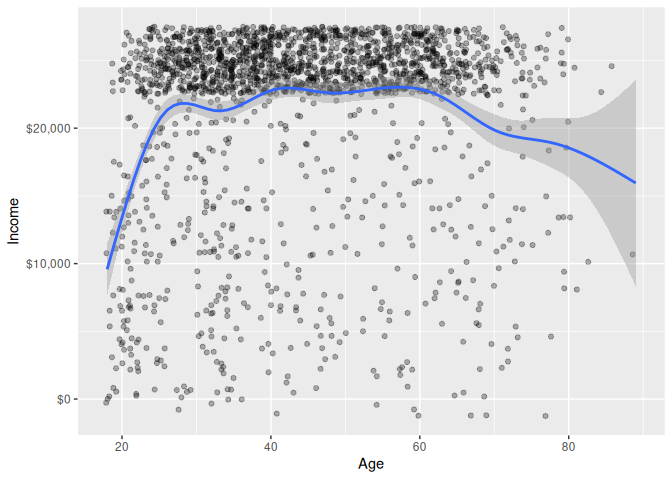
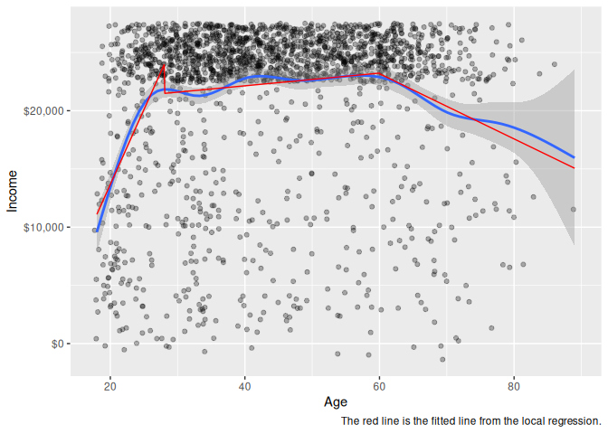
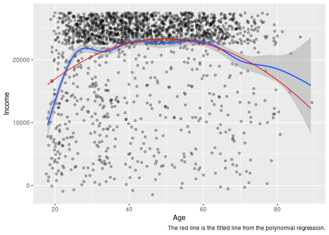

# Lecture 11: Non-linear regression
Romain Ferrali

``` r
suppressPackageStartupMessages(library(tidyverse))
library(modelsummary)
source("./lectures/helpers.R")
df <- read_csv("./data/lecture-7-gss.csv", show_col_types = FALSE) |>
  clean_gss()
```

    Warning: There was 1 warning in `mutate()`.
    ℹ In argument: `age = as.numeric(age)`.
    Caused by warning:
    ! NAs introduced by coercion

# Non-linear regression

Sometimes, the relationship between the independent variable(s) and the
dependent variable is not linear. In these cases, we can use non-linear
regression to model the relationship. There is a well-known non-linear
relationship: age and income. Income tends to increase with age, but it
tends to decrease after a certain age (e.g., after retirement). This is
a non-linear relationship, because the relationship between age and
income is not a straight line.

``` r
ggplot(df, aes(x = age, y = income)) +
  geom_jitter(height = 2500, alpha = .3) +
  scale_y_continuous(labels = scales::dollar) +
  labs(
    x = "Age",
    y = "Income",
    caption = "The figure hints at a non-linear relationship between age and income."
  )
```

    Warning: Removed 1625 rows containing missing values or values outside the scale range
    (`geom_point()`).


There are two ways to model non-linear relationships:

- Split your data into bins, and then use linear regression on the
  binned data. We call this a local regression, because we’re fitting a
  linear regression to a local subset of the data (i.e., the data in
  each bin).
- Transform the independent variable(s) or the dependent variable, and
  then use linear regression on the transformed variables.

# Local regression

The idea of local regression is to split the data into bins, and then
fit a linear regression to each bin. This allows us to capture
non-linear relationships, because we’re fitting a different linear
regression to each bin. The most common way to do this is to use a
method called LOESS (locally estimated scatterplot smoothing).

``` r
#| label: a non-linear relationship

ggplot(df, aes(x = age, y = income)) +
  geom_jitter(height = 2500, alpha = .3) +
  scale_y_continuous(labels = scales::dollar) +
  # we've used geom_smooth() before, with method = "lm"
  # to fit a linear regression line to the data
  # now, we use the default method, which is "loess", to fit a non-linear regression
  geom_smooth() +
  labs(
    x = "Age",
    y = "Income"
  )
```

    `geom_smooth()` using method = 'gam' and formula = 'y ~ s(x, bs = "cs")'

    Warning: Removed 1625 rows containing non-finite outside the scale range
    (`stat_smooth()`).

    Warning: Removed 1625 rows containing missing values or values outside the scale range
    (`geom_point()`).



Our LOESS fit confirms that the relationship is non-linear. Notice how
it plateaus between ages 28 and 60. This is because our data is
top-coded: the maximum reported income is \$25,000, which is not a lot
for people in their 30s, 40s, and 50s. This is a problem with the data,
not with the LOESS fit. The LOESS fit is doing its job: it’s fitting a
non-linear regression to the data, and it’s showing us that the
relationship between age and income is non-linear.

We can use the information from the LOESS fit to split the data into
bins, and then fit a linear regression to each bin. For example, we can
split the data into three bins: “Young” (age \<= 28), “Middle-Aged” (28
\< age \<= 60), and “Old” (age \> 60). Then, we can fit a linear
regression to each bin, and compare the coefficients of the linear
regressions across the bins. In essence, this is what the LOESS fit is
doing, except that, unlike us, it picks the bins in a data-driven way,
rather than using arbitrary cutoffs (e.g., 28 and 60).

``` r
binned_regressions <- list(
  Young = lm(income ~ age, data = df |> filter(age <= 28)),
  `Middle-Aged` = lm(income ~ age, data = df |> filter(age > 28, age <= 60)),
  Old = lm(income ~ age, data = df |> filter(age > 60))
)

modelsummary(binned_regressions, stars = T)
```

<table style="width:83%;">
<colgroup>
<col style="width: 19%" />
<col style="width: 22%" />
<col style="width: 20%" />
<col style="width: 20%" />
</colgroup>
<thead>
<tr>
<th></th>
<th>Young</th>
<th>Middle-Aged</th>
<th>Old</th>
</tr>
</thead>
<tbody>
<tr>
<td>(Intercept)</td>
<td>-12046.278***</td>
<td>19959.577***</td>
<td>39974.649***</td>
</tr>
<tr>
<td></td>
<td>(3513.905)</td>
<td>(800.638)</td>
<td>(4641.452)</td>
</tr>
<tr>
<td>age</td>
<td>1285.800***</td>
<td>54.497**</td>
<td>-279.970***</td>
</tr>
<tr>
<td></td>
<td>(146.213)</td>
<td>(18.039)</td>
<td>(68.503)</td>
</tr>
<tr>
<td>Num.Obs.</td>
<td>310</td>
<td>1294</td>
<td>315</td>
</tr>
<tr>
<td>R2</td>
<td>0.201</td>
<td>0.007</td>
<td>0.051</td>
</tr>
<tr>
<td>R2 Adj.</td>
<td>0.198</td>
<td>0.006</td>
<td>0.048</td>
</tr>
<tr>
<td>AIC</td>
<td>6399.7</td>
<td>26198.0</td>
<td>6449.3</td>
</tr>
<tr>
<td>BIC</td>
<td>6410.9</td>
<td>26213.5</td>
<td>6460.6</td>
</tr>
<tr>
<td>Log.Lik.</td>
<td>-3196.860</td>
<td>-13096.025</td>
<td>-3221.668</td>
</tr>
<tr>
<td>RMSE</td>
<td>7284.57</td>
<td>6012.75</td>
<td>6691.41</td>
</tr>
</tbody><tfoot>
<tr>
<td colspan="4"><ul>
<li>p &lt; 0.1, * p &lt; 0.05, ** p &lt; 0.01, *** p &lt; 0.001</li>
</ul></td>
</tr>
</tfoot>
&#10;</table>

We can also use those same regressions to create a plot of the fitted
lines for each bin. This is a nice way to visualize the non-linear
relationship between age and income. Let’s compare it to the LOESS fit.

``` r
# create a new dataset for plotting the fitted lines from the binned regressions
# we will add predicted income to this dataset, using the predict() function
pl <- tibble(
  age = seq(18, 89, by = .1)
)
# get predicted income, feeding each subset of the data to the corresponding regression
pl$income <- c(
  predict(
    binned_regressions$Young,
    newdata = pl |> filter(age <= 28)
  ),
  predict(
    binned_regressions$`Middle-Aged`,
    newdata = pl |> filter(age > 28, age <= 60)
  ),
  predict(binned_regressions$Old, newdata = pl |> filter(age > 60))
)

ggplot(df, aes(x = age, y = income)) +
  geom_jitter(height = 2500, alpha = .3) +
  scale_y_continuous(labels = scales::dollar) +
  geom_smooth() +
  # notice how we feed different data to geom_line():
  # the main plot uses df (the original data)
  # but the line uses pl, which contains the predicted income from the binned regressions
  geom_line(data = pl, color = "red") +
  labs(
    x = "Age",
    y = "Income",
    caption = "The red line is the fitted line from the local regression."
  )
```

    `geom_smooth()` using method = 'gam' and formula = 'y ~ s(x, bs = "cs")'

    Warning: Removed 1625 rows containing non-finite outside the scale range
    (`stat_smooth()`).

    Warning: Removed 1625 rows containing missing values or values outside the scale range
    (`geom_point()`).



# Transforming the data

## In a nutshell

There are two common tricks:

1.  Transform the independent variable(s) using a non-linear function;
    typically, a polynomial function (e.g., age^2).
2.  Transform the dependent variable using a non-linear function;
    typically, a logarithmic function (e.g., log(income)). This is
    especially common for data such as income, which tends to be
    right-skewed (i.e., there are a few very high values that can
    distort the relationship between the independent variable(s) and the
    dependent variable). By taking the logarithm of income, we can
    reduce the skewness and make the relationship more linear. The log
    trick for the dependent variable can also be used for independent
    variables (again, when the independent variable is right-skewed).

## Tradeoffs

The benefit of transforming the data is that we can use linear
regression to model non-linear relationships. With this, we get all our
tests and p-values for free. There are two downsides:

1.  You have to choose the right transformation, which can be tricky.
    For example, if you choose a polynomial transformation, you have to
    choose the degree of the polynomial (e.g., age^2, age^3, etc.). If
    you choose a logarithmic transformation, you have to make sure that
    there are no zero or negative values in the data (because log(0) and
    log(negative) are undefined).
2.  The coefficients of the linear regression are not as interpretable
    as they are in a linear regression with untransformed variables. For
    example, if you have a polynomial transformation, the coefficient of
    age^2 is not as interpretable as the coefficient of age in a linear
    regression with untransformed variables.

## How to do this in R

Let’s see how to do this.

``` r
df <- df |>
  mutate(age_sqr = age^2)

mod_polynomial <- lm(income ~ age + age_sqr, data = df)

modelsummary(mod_polynomial, stars = T)
```

<table style="width:39%;">
<colgroup>
<col style="width: 19%" />
<col style="width: 19%" />
</colgroup>
<thead>
<tr>
<th></th>
<th><ol type="1">
<li></li>
</ol></th>
</tr>
</thead>
<tbody>
<tr>
<td>(Intercept)</td>
<td>5468.934***</td>
</tr>
<tr>
<td></td>
<td>(1297.659)</td>
</tr>
<tr>
<td>age</td>
<td>717.740***</td>
</tr>
<tr>
<td></td>
<td>(59.192)</td>
</tr>
<tr>
<td>age_sqr</td>
<td>-7.206***</td>
</tr>
<tr>
<td></td>
<td>(0.629)</td>
</tr>
<tr>
<td>Num.Obs.</td>
<td>1919</td>
</tr>
<tr>
<td>R2</td>
<td>0.075</td>
</tr>
<tr>
<td>R2 Adj.</td>
<td>0.074</td>
</tr>
<tr>
<td>AIC</td>
<td>39113.7</td>
</tr>
<tr>
<td>BIC</td>
<td>39135.9</td>
</tr>
<tr>
<td>Log.Lik.</td>
<td>-19552.847</td>
</tr>
<tr>
<td>RMSE</td>
<td>6439.09</td>
</tr>
</tbody><tfoot>
<tr>
<td colspan="2"><ul>
<li>p &lt; 0.1, * p &lt; 0.05, ** p &lt; 0.01, *** p &lt; 0.001</li>
</ul></td>
</tr>
</tfoot>
&#10;</table>

In the regression table above, we see that the coefficient of age^2 is
negative and significant.

- Negative: this means that the relationship between age and income is
  inverse-U shaped (like $-x^2$)
- Significant: this proves that the relationship is non-linear, because
  if the relationship were linear, the coefficient of age^2 would be
  zero (i.e., not significant). That’s an **important benefit of using a
  polynomial transformation: we can test for non-linearity** by looking
  at the significance of the coefficient of the polynomial term (e.g.,
  age^2).

How well does the polynomial regression fit the data? We can create a
plot of the fitted line from the polynomial regression, and compare it
to the LOESS fit.

``` r
# same approach as with the binned regressions:
# we create a new dataset for plotting the fitted line
# from the polynomial regression,
# and we add predicted income to this dataset using the predict() function

pl <- tibble(
  age = seq(18, 89, by = .1)
) |>
  mutate(
    age_sqr = age^2
  )
pl$income <- predict(mod_polynomial, newdata = pl)

ggplot(df, aes(x = age, y = income)) +
  geom_jitter(height = 2500, alpha = .3) +
  geom_smooth() +
  geom_line(data = pl, color = "red") +
  labs(
    x = "Age",
    y = "Income",
    caption = "The red line is the fitted line from the polynomial regression."
  )
```

    `geom_smooth()` using method = 'gam' and formula = 'y ~ s(x, bs = "cs")'

    Warning: Removed 1625 rows containing non-finite outside the scale range
    (`stat_smooth()`).

    Warning: Removed 1625 rows containing missing values or values outside the scale range
    (`geom_point()`).



Another important benefit of a polynomial regression is that we can use
the coefficients to calculate things. Example: we can calculate the age
at which income is maximized (i.e., the peak of the inverse-U shape).
Remember that our polynomial regression is of the form:

$$
f(x) = \beta_0 + \beta_1 x + \beta_2 x^2
$$

This function is maximized at the point where the derivative is zero.

$$
f'(x) = 0 \iff \beta_1 + 2 \beta_2 x = 0 \iff x = -\frac{\beta_1}{2 \beta_2}
$$

In our model, parameter $\beta_1$ is `age`, and parameter $\beta_2$ is
`age_sqr`. We can calculate this in R using the coefficients from the
polynomial regression:

``` r
# peak age = -beta_1 / (2 * beta_2)
-coef(mod_polynomial)["age"] / (2 * coef(mod_polynomial)["age_sqr"])
```

         age 
    49.79836 
