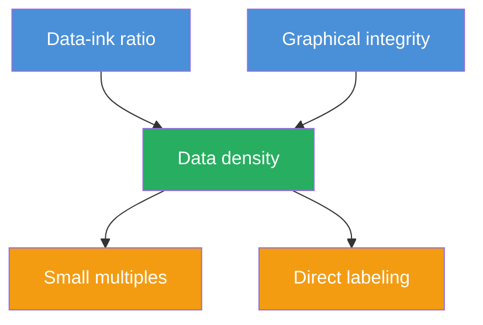
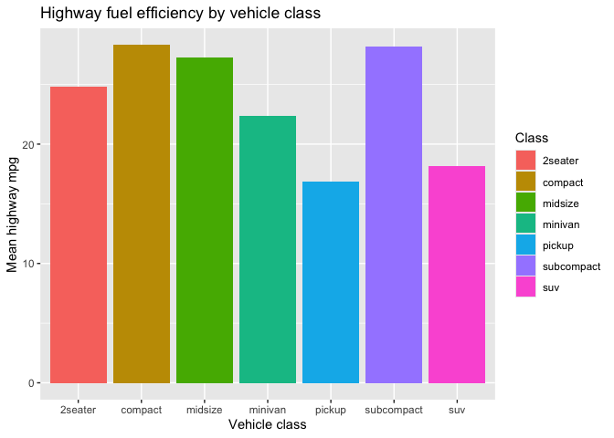
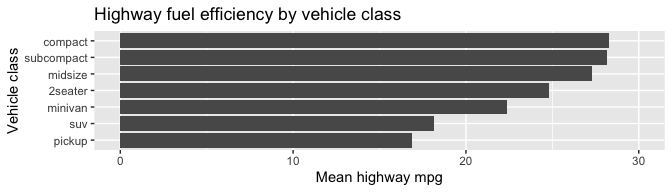
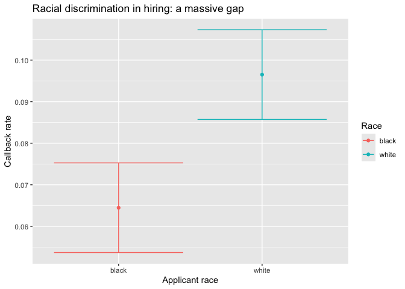
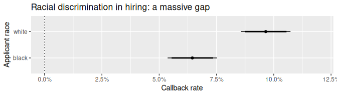
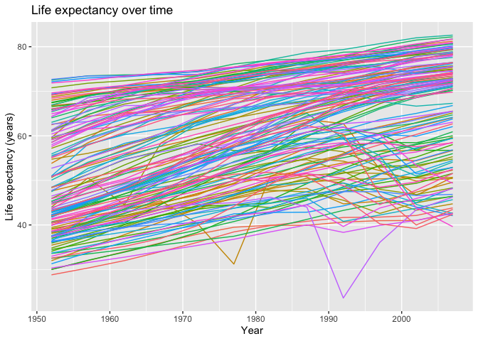
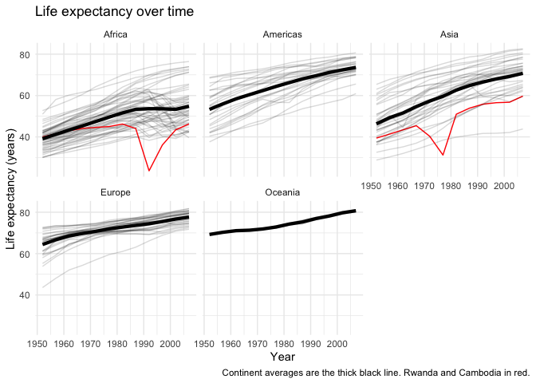
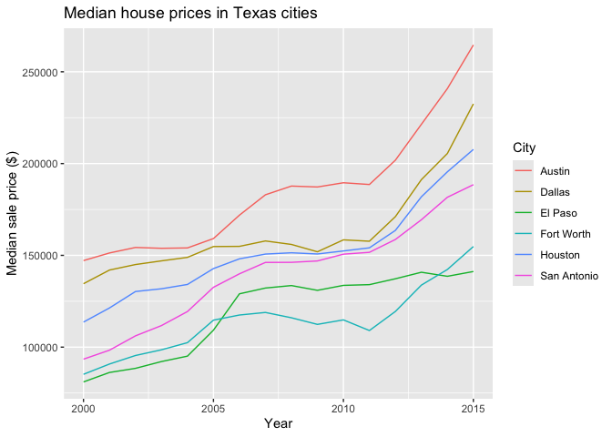
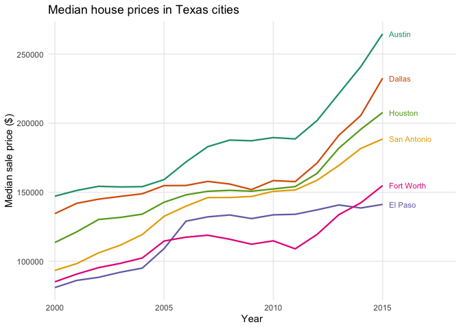

# Lecture 16: Data visualization
Romain Ferrali

## Principles of good data visualization

Good data visualization is not just about aesthetics. It is about
**communicating information as clearly and honestly as possible**. The
most influential framework for thinking about this comes from Edward
Tufte, a statistician and designer who laid out a set of principles in
his 1983 book *The Visual Display of Quantitative Information*.

The five core principles are:

1.  **Data-ink ratio.** Every drop of ink should earn its place by
    encoding data. Remove everything that does not carry information:
    background colors, redundant gridlines, unnecessary borders,
    decorative elements.

2.  **Graphical integrity.** The visual representation must not distort
    the data. The most common violation is truncating the y-axis to make
    a small difference look large.

3.  **Data density.** Show as much data as possible in a compact space.
    Aggregating to a single mean hides variation; showing the raw
    distribution is almost always better.

4.  **Small multiples.** When a relationship varies across groups,
    repeat the same chart structure for each group side by side. This
    makes comparisons natural and avoids overloaded single plots.

5.  **Direct labeling.** Label data directly on the chart rather than
    forcing the reader to look up a legend. Every time a reader’s eyes
    travel away from the data, information is lost.

These principles are not rules to follow mechanically. They are
heuristics that help you ask: *is every element of this plot earning its
place?*



------------------------------------------------------------------------

## Example 1: Data-ink ratio

We use the `mpg` dataset (built into ggplot2), which contains fuel
economy data for 234 cars across 7 vehicle classes.

**A first attempt.** Here is a bar chart of mean highway fuel efficiency
by vehicle class.

``` r
mpg |>
  group_by(class) |>
  summarize(mean_hwy = mean(hwy)) |>
  ggplot(aes(x = class, y = mean_hwy, fill = class)) +
  geom_col() +
  labs(
    title = "Highway fuel efficiency by vehicle class",
    x = "Vehicle class",
    y = "Mean highway mpg",
    fill = "Class"
  )
```



**What is wrong with this plot?**

- **Redundant color.** The vehicle class is already shown on the x-axis
  labels; mapping `fill = class` adds nothing and generates a legend
  that repeats the same information.
- **Unsorted bars.** When bars are in arbitrary order, pairwise
  comparisons are hard. For example, it is difficult to tell whether
  subcompact or compact is more fuel-efficient because the bars are far
  apart and nearly the same height.
- **Wasted vertical space.** All values fall between 20 and 28 mpg, but
  the y-axis starts at 0. The bottom half of the plot is mostly empty
  ink.
- **Poor use of page space.** Vertical bars force the figure to be tall.
  Since papers offer more horizontal than vertical space, the layout is
  inefficient.

**A better version.**

``` r
mpg |>
  group_by(class) |>
  summarize(mean_hwy = mean(hwy)) |>
  # Sort ascending so bars appear in order from least to most efficient
  arrange(mean_hwy) |>
  mutate(
    class = as_factor(class),
    # Lock in the sorted order so ggplot respects it on the axis
    class = fct_inorder(class)
  ) |>
  ggplot(aes(x = class, y = mean_hwy)) +
  geom_col() +
  # Start at 0 for graphical integrity; cap at 30 (a round number) for clean tick marks
  scale_y_continuous(limits = c(0, 30)) +
  # Flip to horizontal: takes advantage of full page width and allows a small fig-height
  coord_flip() +
  labs(
    title = "Highway fuel efficiency by vehicle class",
    x = "Vehicle class",
    y = "Mean highway mpg"
  )
```



**What makes this plot better?**

- **Sorted order** makes rankings immediately readable: compact is
  slightly more efficient than subcompact, while pickup trucks and SUVs
  are clearly at the bottom.
- **No redundant color**: removing `fill = class` eliminates the
  unnecessary legend.
- **Full y-axis from 0 to 30** preserves graphical integrity while using
  a round upper limit for clean tick marks.
- **`coord_flip()` + `fig-height: 2`**: horizontal bars exploit the full
  page width while keeping the figure vertically compact — a plot that
  conveys as much information in two inches of height.

## Example 2: Graphical integrity

We use the resume experiment dataset from Bertrand and Mullainathan
(2004). Researchers sent fictitious resumes with stereotypically Black
or White names to job postings and recorded whether the applicant
received a callback.

We start from a regression model. Regressing callback on race gives us
predicted callback rates for each group, along with standard errors we
can use to construct confidence intervals.

``` r
# Regress callback on race
mod <- lm(call ~ race, data = df_resume)

# Predict callback rates for each group at 90% and 95% confidence levels
preds <- tibble(race = c("black", "white"))
ci <- predict(mod, preds, interval = "confidence", level = 0.95)
ci_90 <- predict(mod, preds, interval = "confidence", level = 0.90)

# Combine into one tibble
preds <- bind_cols(
  preds,
  as_tibble(ci),
  as_tibble(ci_90) |>
    select(
      lwr_90 = lwr,
      upr_90 = upr
    )
)
```

**A misleading plot.**

``` r
ggplot(preds, aes(x = race, y = fit, color = race, ymin = lwr, ymax = upr)) +
  geom_point() +
  geom_errorbar() +
  labs(
    title = "Racial discrimination in hiring: a massive gap",
    x = "Applicant race",
    y = "Callback rate",
    color = "Race"
  )
```



**What is wrong with this plot?**

- **Truncated y-axis.** The axis does not start at 0, so it’s hard to
  evaluate how large the gap between Black and White callback rates
  actually is. Starting from 0 reveals the true magnitude: the Black
  callback rate (~6%) is about two-thirds of the White rate (~9%), which
  is a large and meaningful difference.
- **Redundant color.** `fill = race` duplicates the x-axis information
  and forces a legend.
- **`geom_errorbar()` adds visual clutter.** The horizontal caps on the
  error bars carry no information and increase ink without adding
  meaning.
- **No percentage formatting.** Raw proportions like 0.064 are harder to
  read than 6.4%.

**A better version.**

``` r
ggplot(preds, aes(x = race, y = fit, ymin = lwr, ymax = upr)) +
  geom_point() +
  # geom_linerange has no caps — cleaner than geom_errorbar
  geom_linerange() +
  # Second linerange for the 90% CI: thicker line (linewidth = 1) visually distinguishes it
  # from the thinner 95% CI above; linewidth is outside aes() because it is a fixed value,
  # not a column of the data
  geom_linerange(aes(ymin = lwr_90, ymax = upr_90), linewidth = 1) +
  # Start at 0 for honest scale; 0.12 is a round upper limit giving clean even tick marks
  # labels = scales::percent converts 0.06 → "6%"
  scale_y_continuous(limits = c(0, 0.12), labels = scales::percent) +
  # add the 0 line, useful to see whether quantities are significant or not.
  geom_hline(yintercept = 0, lty = "dotted") +
  coord_flip() +
  labs(
    title = "Racial discrimination in hiring: a massive gap",
    x = "Applicant race",
    y = "Callback rate"
  )
```



**What makes this plot better?**

- **Axis starting at 0** preserves graphical integrity: the reader can
  see that the Black callback rate is roughly two-thirds of the White
  rate, conveying the real magnitude of the gap. Cropping the axis would
  have hidden this.
- **`geom_linerange()` instead of `geom_errorbar()`** removes the
  horizontal caps, reducing ink without losing information.
- **Two confidence interval bands** (90% thick, 95% thin) add
  information at almost no visual cost — a common and useful convention
  in empirical research.
- **0 line** makes it easy to check whether the quantities we represent
  are significant (confidence interval does not cross the line) or not
  (confidence interval crosses the line).
- **`linewidth` outside `aes()`**: fixed graphical options (not mapped
  to data columns) must go outside `aes()`; placing them inside `aes()`
  confuses ggplot into treating the value as a data column name.

## Example 3: Small multiples and data density

We use the `gapminder` dataset, which tracks life expectancy, GDP per
capita, and population for 142 countries across 5 continents from 1952
to 2007.

**The spaghetti plot.** Here is life expectancy over time for all
countries at once.

``` r
ggplot(gapminder, aes(x = year, y = lifeExp, color = country)) +
  geom_line() +
  scale_color_discrete(guide = "none") +
  theme(legend.position = "right") +
  labs(
    title = "Life expectancy over time",
    x = "Year",
    y = "Life expectancy (years)"
  )
```



**What is wrong with this plot?**

- **Too many lines.** With 142 countries all on one panel, the plot is
  unreadable — the lines overlap into a dense mass with no discernible
  pattern.
- **Legend consumes most of the figure area.** 142 colors in a legend is
  useless; the reader cannot match any line to its country.
- **No way to see both the global trend and individual stories.** The
  plot obscures both: the overall upward trend in life expectancy and
  the dramatic drops in specific countries (wars, genocides) are
  invisible in the noise.
- **No continental context.** Knowing that most drops happen in Africa
  rather than Europe or the Americas is an important part of the story,
  but the single panel hides it.

**A better version.**

``` r
# Compute continent-level average for the thick overlay line
gl_data <- gapminder |>
  group_by(year, continent) |>
  summarize(lifeExp = mean(lifeExp))
```

    `summarise()` has regrouped the output.
    ℹ Summaries were computed grouped by year and continent.
    ℹ Output is grouped by year.
    ℹ Use `summarise(.groups = "drop_last")` to silence this message.
    ℹ Use `summarise(.by = c(year, continent))` for per-operation grouping
      (`?dplyr::dplyr_by`) instead.

``` r
gapminder |>
  # Create a boolean column to optionally highlight a few countries
  mutate(
    highlight = country %in%
      c("Rwanda", "Cambodia")
  ) |>
  ggplot(aes(x = year, y = lifeExp)) +
  # Use group = country (not color = country) to draw one line per country
  # without generating a 142-color legend; color and alpha are mapped to
  # the highlight variable so one country can be made to stand out
  geom_line(aes(group = country, color = highlight, alpha = highlight)) +
  scale_color_manual(
    # set the colors manually, so we control what stands out
    values = c("TRUE" = "red", "FALSE" = "black"),
    guide = "none" # hide the legend; highlights aren't worth a legend
  ) +
  scale_alpha_manual(
    # make only the non-highlighted lines transparent
    values = c("TRUE" = 1, "FALSE" = .15),
    guide = "none" # hide the legend
  ) +
  # Overlay thick black line for the continent mean using a different dataset;
  # specifying data = gl_data overrides the main dataset for this layer only
  geom_line(data = gl_data, linewidth = 1.5) +
  theme_minimal() +
  labs(
    title = "Life expectancy over time",
    x = "Year",
    y = "Life expectancy (years)",
    caption = "Continent averages are the thick black line. Rwanda and Cambodia in red."
  ) +
  # Small multiples by continent: 5 panels × ~30 countries each is far more
  # readable than 1 panel × 142 countries
  facet_wrap(~continent)
```



**What makes this plot better?**

- **Small multiples (`facet_wrap`)** break the spaghetti into 5 panels
  by continent, making individual country lines legible and enabling
  direct continental comparisons. Africa in 2007 is roughly where the
  Americas were in 1952 — a striking fact that only becomes visible once
  the data are split.
- **Forest and trees simultaneously**: the transparent gray country
  lines (the trees) show individual variation and dramatic drops (wars,
  epidemics), while the thick black continent-average line (the forest)
  gives the global upward trend.
- **`group = country` instead of `color = country`** draws one line per
  country without coloring them — eliminating the 142-entry legend
  entirely.
- **Highlighting a specific country** (`color = highlight`,
  `alpha = highlight`) is a clean way to tell one country’s story within
  the broader context, without cluttering the rest of the plot.

------------------------------------------------------------------------

## Example 4: Direct labeling

We use the `txhousing` dataset (built into ggplot2), which tracks
monthly median house sale prices across Texas cities. We compare 6 major
cities.

**A plot with a legend.**

``` r
ggplot(tx_annual, aes(x = year, y = median_price, color = city)) +
  geom_line() +
  labs(
    title = "Median house prices in Texas cities",
    x = "Year",
    y = "Median sale price ($)",
    color = "City"
  )
```



**What is wrong with this plot?**

- To identify a line, the reader must: (1) look at the line, (2) note
  its color, (3) scan the legend, (4) return to the data. This happens
  every time.
- The default ggplot2 color palette is not optimized for perceptual
  distinctiveness.
- The legend occupies space outside the plot, reducing the data area.

**Direct labeling: place the city name at the end of each line.**

``` r
# Keep only the last observation per city to position the labels
tx_labels <- tx_annual |>
  group_by(city) |>
  slice_max(year, n = 1)

ggplot(tx_annual, aes(x = year, y = median_price, color = city)) +
  geom_line(linewidth = 0.8) +
  # place label just to the right of the terminal point
  geom_text(
    data = tx_labels,
    aes(label = city),
    hjust = 0, # anchor text to the left (so it extends rightward)
    nudge_x = 0.3,
    size = 3
  ) +
  # extend the x-axis to make room for labels on the right
  scale_x_continuous(expand = expansion(mult = c(0.02, 0.2))) +
  scale_color_brewer(palette = "Dark2") +
  theme_minimal() +
  theme(
    legend.position = "none",
    panel.grid.minor = element_blank()
  ) +
  labs(
    title = "Median house prices in Texas cities",
    x = "Year",
    y = "Median sale price ($)"
  )
```



The reader can now follow any line directly to its label without leaving
the data area. Key changes: `geom_text()` with `hjust = 0` places city
names just to the right of each line’s endpoint;
`scale_color_brewer(palette = "Dark2")` provides a more perceptually
distinct palette; `scale_x_continuous(expand = ...)` creates space for
the labels on the right.
