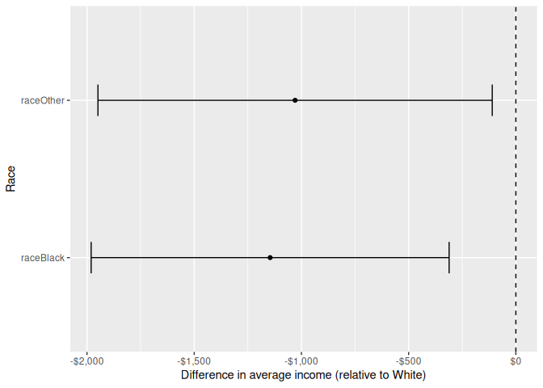
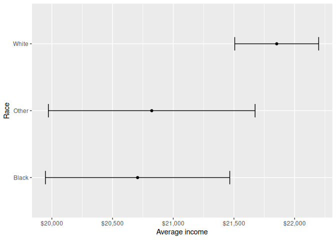
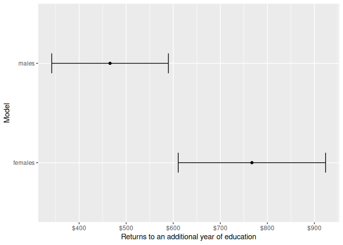

# Lecture 8-9: advanced linear regression, tables and plots
Romain Ferrali

``` r
suppressPackageStartupMessages(library(tidyverse))
library(modelsummary)
library(broom)
library(marginaleffects)
# library(knitr) # we will use only one function from this package, so we can load it separately
df <- read_csv("./data/lecture-7-gss.csv", show_col_types = FALSE)
```

``` r
df <- df |>
  mutate(
    # trun sex into a binary variable that = 1 for female,
    # 0 for male, NA for everything else
    female = case_match(
      sex,
      "FEMALE" ~ 1,
      "MALE" ~ 0,
      .default = NA
    ),
    # remove negative values from height, and convert from inches to cm
    height = ifelse(rheight < 0, NA, rheight),
    height = height * 2.54,
    # turn income bins into a numeric variable by taking the midpoint of each bin
    # for the top bin, we assign it a value of 25000
    # for the bottom bin, we assign it a value of 1000
    income = case_match(
      rincome,
      "$25000 OR MORE" ~ 25000,
      "$20000 - 24999" ~ 22500,
      "$15000 - 19999" ~ 17500,
      "$10000 - 14999" ~ 12500,
      "$8000 TO 9999" ~ 9000,
      "$7000 TO 7999" ~ 7500,
      "$6000 TO 6999" ~ 6500,
      "$5000 TO 5999" ~ 5500,
      "$4000 TO 4999" ~ 4500,
      "$3000 TO 3999" ~ 3500,
      "$1000 TO 2999" ~ 2000,
      "LT $1000" ~ 1000,
      .default = NA
    ),
    # race: we keep only the three meaningful categories,
    # and set the rest (missing race, ...) to NA
    race = ifelse(race %in% c("Black", "White", "Other"), race, NA),
    # turn education categories into a numeric variables
    # (i.e., years of education)
    edu = case_match(
      educ,
      "No formal schooling" ~ 0,
      "1st grade" ~ 1,
      "2nd grade" ~ 2,
      "3rd grade" ~ 3,
      "4th grade" ~ 4,
      "5th grade" ~ 5,
      "6th grade" ~ 6,
      "7th grade" ~ 7,
      "8th grade" ~ 8,
      "9th grade" ~ 9,
      "10th grade" ~ 10,
      "11th grade" ~ 11,
      "12th grade" ~ 12,
      "1 year of college" ~ 13,
      "2 years of college" ~ 14,
      "3 years of college" ~ 15,
      "4 years of college" ~ 16,
      "5 years of college" ~ 17,
      "6 years of college" ~ 18,
      "7 years of college" ~ 19,
      "8 or more years of college" ~ 20,
      .default = NA
    ),
    # age: we set the top bin to 89, and convert to numeric
    age = ifelse(age == "89 or older", 89, age),
    # converting to numeric will turn "missing" into an NA automatically
    # R will give us a warning when doing this
    # we can ignore the warning, because we actually want the "missing" values to be turned into NAs
    age = as.numeric(age)
  ) |>
  select(age, female, height, income, edu, race)
```

    Warning: There was 1 warning in `mutate()`.
    ℹ In argument: `age = as.numeric(age)`.
    Caused by warning:
    ! NAs introduced by coercion

## Model fit: the R-squared

The $R^2$ is a common measure of model fit for linear regression. It is
the proportion of variance in the outcome variable that is explained by
the model. The $R^2$ can be calculated as:

$$
R^2 = 1 - \frac{SS_{res}}{SS_{tot}}
$$

Where $SS_{res}$ is the sum of squared residuals (so, the sum of
$\epsilon_i^2$’s; i.e., the difference between the observed and
predicted values) and $SS_{tot}$ is the total sum of squares (the
variance of the outcome variable). The $R^2$ ranges from 0 to 1, with
higher values indicating a better fit of the model to the data.

Adding variables to the model will always (weakly) increase the $R^2$,
even if those variables are not actually related to the outcome
variable. In other words, say you estimate model 1, and call its
R-squared $R^2_1$. Add variables to model 1, and call the new model
model 2, and its R-squared $R^2_2$. We have

$$
R^2_2 \geq R^2_1
$$

This is because if a variable doesn’t improve the fit at all, we assign
it a coefficient of 0, and the $R^2$ won’t change. Example:

``` r
df_mini <- df |> select(height, income, female) |> na.omit()

model_1 <- lm(income ~ height, data = df_mini)
model_2 <- lm(income ~ height + female, data = df_mini)

# access the R-squared values from the model summaries
summary(model_1)$r.squared # r squared for model 1
```

    [1] 0.02486121

``` r
summary(model_2)$r.squared # r squared for model 2; it is higher than model 1
```

    [1] 0.02513987

To adjust for that, we can use the adjusted $R^2$, which penalizes the
addition of variables to the model. Most people don’t care much about
the adjusted $R^2$.

## Making tables

The function `kable` from the `knitr` package is a simple way to create
tables in R. It takes a data frame as input and returns a formatted
table. Typically, `kable` is the only function you’ll be using from the
`knitr` package, so you can load it directly without loading the entire
package, using notation `knitr::kable()`.

``` r
# you can use kable to create a simple table from a data frame
# you can use block options to add a caption to the table.
# Specifically, the option tbl-cap adds a caption to the table
knitr::kable(head(df))
```

| age | female | height | income | edu | race  |
|----:|-------:|-------:|-------:|----:|:------|
|  72 |      1 | 162.56 |  25000 |  16 | White |
|  80 |      0 |     NA |     NA |  18 | White |
|  57 |      1 | 160.02 |  25000 |  12 | White |
|  23 |      1 |     NA |   5500 |  16 | White |
|  62 |      0 | 180.34 |     NA |  14 | White |
|  27 |      0 | 182.88 |  25000 |  12 | White |

Basic table

The function `modelsummary` from the `modelsummary` package is a
powerful way to create regression tables in R. It takes a list of models
as input and returns a formatted table with the coefficients, standard
errors, and other statistics for each model. You can customize the table
using various options, such as adding stars to indicate statistical
significance.

``` r
modelsummary(
  list(model_1, model_2),
  stars = TRUE
)
```

<table style="width:56%;">
<caption>Our first regression table</caption>
<colgroup>
<col style="width: 19%" />
<col style="width: 18%" />
<col style="width: 18%" />
</colgroup>
<thead>
<tr>
<th></th>
<th><ol type="1">
<li></li>
</ol></th>
<th><ol start="2" type="1">
<li></li>
</ol></th>
</tr>
</thead>
<tbody>
<tr>
<td>(Intercept)</td>
<td>3097.962</td>
<td>5092.063</td>
</tr>
<tr>
<td></td>
<td>(4568.906)</td>
<td>(6586.097)</td>
</tr>
<tr>
<td>height</td>
<td>106.075***</td>
<td>95.367**</td>
</tr>
<tr>
<td></td>
<td>(26.680)</td>
<td>(36.889)</td>
</tr>
<tr>
<td>female</td>
<td></td>
<td>-324.489</td>
</tr>
<tr>
<td></td>
<td></td>
<td>(771.424)</td>
</tr>
<tr>
<td>Num.Obs.</td>
<td>622</td>
<td>622</td>
</tr>
<tr>
<td>R2</td>
<td>0.025</td>
<td>0.025</td>
</tr>
<tr>
<td>R2 Adj.</td>
<td>0.023</td>
<td>0.022</td>
</tr>
<tr>
<td>AIC</td>
<td>12775.5</td>
<td>12777.3</td>
</tr>
<tr>
<td>BIC</td>
<td>12788.8</td>
<td>12795.0</td>
</tr>
<tr>
<td>Log.Lik.</td>
<td>-6384.732</td>
<td>-6384.643</td>
</tr>
<tr>
<td>RMSE</td>
<td>6945.88</td>
<td>6944.89</td>
</tr>
</tbody><tfoot>
<tr>
<td colspan="3"><ul>
<li>p &lt; 0.1, * p &lt; 0.05, ** p &lt; 0.01, *** p &lt; 0.001</li>
</ul></td>
</tr>
</tfoot>
&#10;</table>

``` r
modelsummary(
  list(
    # you can give custom names to the models by using a named list
    # notice how I use backticks to allow for spaces in the model names
    `Baseline model` = model_1,
    `Larger model` = model_2
  ),
  stars = TRUE,
  # you can tweak the statistics that are displayed in the table using the gof_map argument
  # here, we only display the number of observations (nobs) and the R-squared (r.squared)
  gof_map = c("nobs", "r.squared")
)
```

<table style="width:64%;">
<caption>A better regression table</caption>
<colgroup>
<col style="width: 19%" />
<col style="width: 23%" />
<col style="width: 20%" />
</colgroup>
<thead>
<tr>
<th></th>
<th>Baseline model</th>
<th>Larger model</th>
</tr>
</thead>
<tbody>
<tr>
<td>(Intercept)</td>
<td>3097.962</td>
<td>5092.063</td>
</tr>
<tr>
<td></td>
<td>(4568.906)</td>
<td>(6586.097)</td>
</tr>
<tr>
<td>height</td>
<td>106.075***</td>
<td>95.367**</td>
</tr>
<tr>
<td></td>
<td>(26.680)</td>
<td>(36.889)</td>
</tr>
<tr>
<td>female</td>
<td></td>
<td>-324.489</td>
</tr>
<tr>
<td></td>
<td></td>
<td>(771.424)</td>
</tr>
<tr>
<td>Num.Obs.</td>
<td>622</td>
<td>622</td>
</tr>
<tr>
<td>R2</td>
<td>0.025</td>
<td>0.025</td>
</tr>
</tbody><tfoot>
<tr>
<td colspan="3"><ul>
<li>p &lt; 0.1, * p &lt; 0.05, ** p &lt; 0.01, *** p &lt; 0.001</li>
</ul></td>
</tr>
</tfoot>
&#10;</table>

## Categorical variables

Let’s try and get a sense of how race affects income. Notice that race
is a **categorical variable**: there are three “categories” (White,
Black, Other). Regression only uses numeric variables, so we need to
convert the race variabble into a numeric variable. To do that, we will
expand the idea of a binary variable that we used for the female
variable.

### Binary variables, take 2

A binary variable, also called a dummy variable, is a variable that
takes the value of 0 or 1. Last time, we ran the following regression:

$$
y_i = \alpha_1 + \beta_1 \text{female}_i + \epsilon_i
$$

We chose to assign the value 1 to female and 0 to male. This means that

- $\alpha_1$ is the average income for males
- $\beta_1$ is the difference in average income between females and
  males
- $\alpha_1 + \beta_1$ is the average income for females

We could have done the opposite, and assigned the value 1 to male and 0
to female. In that case, we would have had

$$
y_i = \alpha_2 + \beta_2 \text{male}_i + \epsilon_i
$$

In this case, we would have had:

- $\alpha_2$ is the average income for females
- $\beta_2$ is the difference in average income between males and
  females
- $\alpha_2 + \beta_2$ is the average income for males

Notice that the two models are equivalent. In other words, we get the
same predicted values for each observation, and the same $R^2$ value.
The only thing that changes is the interpretation of the coefficients.
Specifically, we have:

- $\alpha_1 = \alpha_2 + \beta_2$: the average income for males
- $\alpha_2 = \alpha_1 + \beta_1$: the average income for females

What we really did, really was to change the **reference category** of
our binary variable. In the first model, the reference category is male,
because we assigned it the value 0. In other words, we get the effect of
being female **relative to the reference** of being male.

## More than two categories

When we have a categorical variable with more than two categories, we
can use the same idea to create multiple dummy variables. We can turn
our race variable into two dummy variables: one for Black and one for
Other. The regression model will look like this:

$$
y_i = \alpha + \beta_1 \text{Black}_i + \beta_2 \text{Other}_i + \epsilon_i
$$

Why didn’t we create a dummy variable for White? Because we need to
choose a reference category, and we will choose White as the reference
category. In this model, we have:

- $\alpha$ is the average income for White people
- $\beta_1$ is the difference in average income between Black and White
  people
- $\beta_2$ is the difference in average income between Other and White
  people
- $\alpha + \beta_1$ is the average income for Black
- $\alpha + \beta_2$ is the average income for Other

If we had added a dummy variable for White, we would have run into a
problem. Look at this wrong model:

$$
y_i = \alpha + \beta_1 \text{Black}_i + \beta_2 \text{Other}_i + \beta_3 \text{White}_i + \epsilon_i
$$

The problem here is that it is unclear what the intercept $\alpha$
represents: there is some confusion between $\beta_3$ and $\alpha$. If
we run a regression with this model, R will complain.

Just like with the binary variable, we could have chosen a different
reference category. For example, we could have chosen Black as the
reference category, and created dummy variables for White and Other. In
that case, the model would look like this:

$$
y_i = \tilde{\alpha} + \tilde{\beta}_1 \text{White}_i + \tilde{\beta}_2 \text{Other}_i + \tilde{\epsilon}_i
$$

In this model, we have:

- $\tilde{\alpha}$ is the average income for Black people
- $\tilde{\beta}_1$ is the difference in average income between White
  and Black people
- $\tilde{\beta}_2$ is the difference in average income between Other
  and Black people
- $\tilde{\alpha} + \tilde{\beta}_1$ is the average income for White
- $\tilde{\alpha} + \tilde{\beta}_2$ is the average income for Other

Again, just like with the binary variable, the two models are
equivalent. We get the same predicted values for each observation, and
the same $R^2$ value. The only thing that changes is the interpretation
of the coefficients. Specifically, we have:

- $\alpha = \tilde{\alpha} + \tilde{\beta}_1$: the average income for
  White people
- $\tilde{\alpha} = \alpha + \beta_1$: the average income for Black
  people
- $\tilde{\alpha} + \tilde{\beta}_2 = \alpha + \beta_2$: the average
  income for Other people

## Categorical variables in R

Now, let’s do this in R. The function `lm` will automatically create
dummy variables for us when we include a categorical variable in the
model. By default, R will choose the reference category as the one that
comes first alphabetically. In our case, that is Black. So, when we run
the following regression, R will automatically create dummy variables
for Other and White, and use Black as the reference category.

``` r
mod_race <- lm(income ~ race, data = df)
modelsummary(list(mod_race), stars = TRUE)
```

<table style="width:40%;">
<colgroup>
<col style="width: 19%" />
<col style="width: 20%" />
</colgroup>
<thead>
<tr>
<th></th>
<th><ol type="1">
<li></li>
</ol></th>
</tr>
</thead>
<tbody>
<tr>
<td>(Intercept)</td>
<td>20706.376***</td>
</tr>
<tr>
<td></td>
<td>(387.380)</td>
</tr>
<tr>
<td>raceOther</td>
<td>116.409</td>
</tr>
<tr>
<td></td>
<td>(582.023)</td>
</tr>
<tr>
<td>raceWhite</td>
<td>1145.952**</td>
</tr>
<tr>
<td></td>
<td>(425.605)</td>
</tr>
<tr>
<td>Num.Obs.</td>
<td>1974</td>
</tr>
<tr>
<td>R2</td>
<td>0.005</td>
</tr>
<tr>
<td>R2 Adj.</td>
<td>0.004</td>
</tr>
<tr>
<td>AIC</td>
<td>40380.8</td>
</tr>
<tr>
<td>BIC</td>
<td>40403.1</td>
</tr>
<tr>
<td>Log.Lik.</td>
<td>-20186.384</td>
</tr>
<tr>
<td>RMSE</td>
<td>6682.14</td>
</tr>
</tbody><tfoot>
<tr>
<td colspan="2"><ul>
<li>p &lt; 0.1, * p &lt; 0.05, <strong> p &lt; 0.01, </strong>* p &lt;
0.001</li>
</ul></td>
</tr>
</tfoot>
&#10;</table>

This is a little awkward to interpret, because there is a natural
grouping between Other and Black. So we probably want to choose White as
the reference category. It turns out R has a data type that is
specifically designed for categorical variables, called a `factor`. A
factor has `levels`, which are ordered. The first level is the reference
category. We can convert our character variable `race` into a factor
variable, and specify the reference category using the `fct_relevel`
function.

``` r
df <- df |>
  mutate(
    # convert race from a character variable to a factor variable
    race = as_factor(race)
  )
# check the levels of the factor variable
# the first level is the reference category
# it is the one that comes first alphabetically, which is "Black"
levels(df$race)
```

    [1] "White" "Other" "Black"

``` r
# change the reference category to "White"
df <- df |>
  mutate(
    race = fct_relevel(race, "White")
  )

# now, our regression model will use White as the reference category
mod_race <- lm(income ~ race, data = df)
modelsummary(list(mod_race), stars = TRUE)
```

<table style="width:40%;">
<colgroup>
<col style="width: 19%" />
<col style="width: 20%" />
</colgroup>
<thead>
<tr>
<th></th>
<th><ol type="1">
<li></li>
</ol></th>
</tr>
</thead>
<tbody>
<tr>
<td>(Intercept)</td>
<td>21852.328***</td>
</tr>
<tr>
<td></td>
<td>(176.285)</td>
</tr>
<tr>
<td>raceOther</td>
<td>-1029.543*</td>
</tr>
<tr>
<td></td>
<td>(468.790)</td>
</tr>
<tr>
<td>raceBlack</td>
<td>-1145.952**</td>
</tr>
<tr>
<td></td>
<td>(425.605)</td>
</tr>
<tr>
<td>Num.Obs.</td>
<td>1974</td>
</tr>
<tr>
<td>R2</td>
<td>0.005</td>
</tr>
<tr>
<td>R2 Adj.</td>
<td>0.004</td>
</tr>
<tr>
<td>AIC</td>
<td>40380.8</td>
</tr>
<tr>
<td>BIC</td>
<td>40403.1</td>
</tr>
<tr>
<td>Log.Lik.</td>
<td>-20186.384</td>
</tr>
<tr>
<td>RMSE</td>
<td>6682.14</td>
</tr>
</tbody><tfoot>
<tr>
<td colspan="2"><ul>
<li>p &lt; 0.1, * p &lt; 0.05, <strong> p &lt; 0.01, </strong>* p &lt;
0.001</li>
</ul></td>
</tr>
</tfoot>
&#10;</table>

We can visualize the coefficients of the model using a coefficient plot.
A coefficient plot is a plot of the coefficients, with error bars
representing the confidence intervals.

``` r
# the function broom::tidy() takes a model object and
# returns a data frame with the coefficients, standard errors, and confidence intervals
# for each term in the model. We can use this data frame to create a coefficient plot using ggplot2.
tidy(mod_race, conf.int = TRUE) |>
  # we remove the intercept, because it represents the average income for the reference category
  # this is very different from the other parameters, which represent
  # differences in average income between the reference category and the other categories
  filter(term != "(Intercept)") |>
  ggplot(aes(x = term, y = estimate)) +
  geom_point() +
  # let's add a dashed line at 0, to make it easier to see which coefficients are statistically significant
  geom_hline(yintercept = 0, linetype = "dashed") +
  # format the y-axis labels as monetary values
  scale_y_continuous(labels = scales::dollar) +
  # let's invert the axes, to take advantage of the horizontal space we have when writing papers
  coord_flip() +
  geom_errorbar(aes(ymin = conf.low, ymax = conf.high), width = 0.2) +
  labs(
    x = "Race",
    y = "Difference in average income (relative to White)"
  )
```



## Linear hypotheses

So, we have estimated the following model:

$$
y_i = \alpha + \beta_1 \text{Black}_i + \beta_2 \text{Other}_i + \epsilon_i
$$

So far, we know that Black people and Other race people have an income
that is significantly lower than White people, because the coefficients
$\beta_1$ and $\beta_2$ are negative and statistically significant. But
there are a few things we don’t know or would like to visualize.

### Are Black people significantly poorer than Other race?

The coefficient plot we just created only shows that the confidence
intervals for Black and Other race parameters ($\beta_1$, $\beta_2$
respectively) overlap with each other. So there is no significant
difference between the two groups. But we can also test this hypothesis
directly. We want to know whether $\beta_1 \neq \beta_2$. The null
hypothesis is that $\beta_1 = \beta_2$, which is equivalent to saying
that $\beta_1 - \beta_2 = 0$. It turns out that you can’t just add the
p-values, or do the difference in confidence intervals. Instead, you
need to test this new (linear) hypothesis separately. The `hypotheses`
function from the `marginaleffects` package lets us do that.

``` r
hypotheses(mod_race, hypothesis = "raceOther - raceBlack = 0")
```


                Hypothesis Estimate Std. Error   z Pr(>|z|)   S 2.5 % 97.5 %
     raceOther-raceBlack=0      116        582 0.2    0.841 0.2 -1024   1257

``` r
# the column Pr(>|z|) is the p-value. It is not significant, so we are confident that there is no significant difference between the two groups.
# the columns 2.5% and 97.5% give the confidence interval for the difference between the two groups.
```

### What is the average income for each group?

Our coefficient plot only shows the differences in average income
between the reference category (White) and the other categories (Black,
Other). It doesn’t show the average income for each group. We can
calculate the average income for each group using the coefficients from
the model. The average income for White people is given by the intercept
$\alpha$. We can get the confidence interval directly using
`broom::tidy()`. The average income for Black people is given by
$\alpha + \beta_1$. That’s a linear hypothesis, so we can get the
confidence interval using `marginaleffects::hypotheses()`.

``` r
# get te plot data:
# a series of 1-row data frames, each containing the estimate and confidence interval for the average income of each group
# we combine them with bind_rows() to get a single data frame that we can use for plotting
pl <- bind_rows(
  # get the average income for White people, which is given by the intercept parameter
  tidy(mod_race, conf.int = TRUE) |>
    filter(term == "(Intercept)") |>
    # give it a more meaningful name, to make the plot easier to read
    mutate(term = "White"),
  # get the average income for Other race, which is given by the linear hypothesis (Intercept) + raceOther
  hypotheses(mod_race, hypothesis = "`(Intercept)` + raceOther = 0") |>
    mutate(term = "Other"),
  hypotheses(mod_race, hypothesis = "`(Intercept)` + raceBlack = 0") |>
    mutate(term = "Black")
)

# make the plot
ggplot(aes(x = term, y = estimate), data = pl) +
  geom_point() +
  scale_y_continuous(labels = scales::dollar) +
  coord_flip() +
  geom_errorbar(aes(ymin = conf.low, ymax = conf.high), width = 0.2) +
  labs(
    x = "Race",
    y = "Average income"
  )
```



## Interaction terms

Now, let’s say we want to estimate returns to education. In other words,
we want to know how much income increases for each additional year of
education. We can estimate the following model:

$$
y_i = \alpha + \beta \text{edu}_i + \epsilon_i
$$

``` r
mod <- lm(income ~ edu, data = df)
summary(mod)
```


    Call:
    lm(formula = income ~ edu, data = df)

    Residuals:
         Min       1Q   Median       3Q      Max 
    -23856.4    143.6   2499.7   3677.7  10156.9 

    Coefficients:
                Estimate Std. Error t value Pr(>|t|)    
    (Intercept) 13076.05     755.72   17.30   <2e-16 ***
    edu           589.02      51.37   11.46   <2e-16 ***
    ---
    Signif. codes:  0 '***' 0.001 '**' 0.01 '*' 0.05 '.' 0.1 ' ' 1

    Residual standard error: 6457 on 1979 degrees of freedom
      (1563 observations deleted due to missingness)
    Multiple R-squared:  0.06229,   Adjusted R-squared:  0.06181 
    F-statistic: 131.5 on 1 and 1979 DF,  p-value: < 2.2e-16

The model below shows that the returns to education are positive and
statistically significant: one additional year of education increases
income by about \$`round(coef(mod)["edu"]`.

However, we might be interested in whether the returns to education are
different for males and females. To answer that question, we can
estimate two separate models; one for males and one for females.

``` r
models <- list(
  males = lm(income ~ edu, data = df |> filter(female == 0)),
  females = lm(income ~ edu, data = df |> filter(female == 1))
)

modelsummary(models, stars = TRUE)
```

<table style="width:60%;">
<colgroup>
<col style="width: 19%" />
<col style="width: 20%" />
<col style="width: 19%" />
</colgroup>
<thead>
<tr>
<th></th>
<th>males</th>
<th>females</th>
</tr>
</thead>
<tbody>
<tr>
<td>(Intercept)</td>
<td>15828.903***</td>
<td>9507.540***</td>
</tr>
<tr>
<td></td>
<td>(916.671)</td>
<td>(1187.427)</td>
</tr>
<tr>
<td>edu</td>
<td>465.712***</td>
<td>767.165***</td>
</tr>
<tr>
<td></td>
<td>(63.131)</td>
<td>(79.755)</td>
</tr>
<tr>
<td>Num.Obs.</td>
<td>971</td>
<td>1009</td>
</tr>
<tr>
<td>R2</td>
<td>0.053</td>
<td>0.084</td>
</tr>
<tr>
<td>R2 Adj.</td>
<td>0.052</td>
<td>0.083</td>
</tr>
<tr>
<td>AIC</td>
<td>19538.8</td>
<td>20732.2</td>
</tr>
<tr>
<td>BIC</td>
<td>19553.4</td>
<td>20747.0</td>
</tr>
<tr>
<td>Log.Lik.</td>
<td>-9766.375</td>
<td>-10363.118</td>
</tr>
<tr>
<td>RMSE</td>
<td>5648.36</td>
<td>6986.56</td>
</tr>
</tbody><tfoot>
<tr>
<td colspan="3"><ul>
<li>p &lt; 0.1, * p &lt; 0.05, ** p &lt; 0.01, *** p &lt; 0.001</li>
</ul></td>
</tr>
</tfoot>
&#10;</table>

The returns to education seem higher for females than for males: one
additional year of education increases income by about
\$`round(coef(models[["males"]])["edu"])` for males, and
\$`round(coef(models[["females"]])["edu"])` for females. But is this
difference statistically significant? We can eyeball it by looking at
the confidence intervals for the two coefficients.

``` r
models |>
  map_dfr(broom::tidy, conf.int = TRUE, .id = "model") |>
  filter(term == "edu") |>
  ggplot(aes(x = model, y = estimate)) +
  geom_point() +
  scale_y_continuous(labels = scales::dollar) +
  coord_flip() +
  geom_errorbar(aes(ymin = conf.low, ymax = conf.high), width = 0.2) +
  labs(
    x = "Model",
    y = "Returns to an additional year of education"
  )
```



We can also test the hypothesis that the returns to education are the
same for males and females by running “two regressions in one”. We can
do that by including an **interaction term** between education and
gender. An interaction term is a variable that is created by multiplying
two variables together. It extends the idea of categorical variables:
instead of just having a different intercept for each group, we also
have a different slope for each group. The model looks like this:

$$
y_i = \alpha + \beta_1 \text{edu}_i + \beta_2 \text{female}_i + \beta_3 \text{edu}_i \times \text{female}_i + \epsilon_i
$$

Why does this work? Let’s look at the model separately for males and
females.

For males, we have $\text{female}_i = 0$, so the model becomes
$y_i = \alpha + \beta_1 \text{edu}_i + \beta_2 \times 0 + \beta_3 \text{edu}_i \times 0 + \epsilon_i$.
This simplifies to $y_i = \alpha + \beta_1 \text{edu}_i + \epsilon_i$;
that is, a line with intercept $\alpha$ and slope $\beta_1$. So the
returns to education for males are given by $\beta_1$.

For females, we have $\text{female}_i = 1$, so the model becomes
$y_i = \alpha + \beta_1 \text{edu}_i + \beta_2 \times 1 + \beta_3 \text{edu}_i \times 1 + \epsilon_i$.
This simplifies to
$y_i = (\alpha + \beta_2) + (\beta_1 + \beta_3) \text{edu}_i + \epsilon_i$;
that is, a line with intercept $\alpha + \beta_2$ and slope
$\beta_1 + \beta_3$. So the returns to education for females are given
by $\beta_1 + \beta_3$.

Notice furthermore that $\beta_3$ is the difference in returns to
education between females and males. We call
$\text{edu}_i \times \text{female}_i$ the **interaction** term, because
it captures the interaction between education and gender. We call
$\text{edu}_i$ and $\text{female}_i$ the **main effects**, because they
capture the main effects of education and gender on income,
respectively.

Now, let’s see how to estimate models with interaction terms in R.

``` r
# the simple way: create a new variable that is the product of education and female
df <- df |> mutate(edu_female = edu * female)
lm(income ~ edu + female + edu_female, data = df) |> summary()
```


    Call:
    lm(formula = income ~ edu + female + edu_female, data = df)

    Residuals:
         Min       1Q   Median       3Q      Max 
    -23850.8    149.2   2185.4   3582.6  11656.6 

    Coefficients:
                Estimate Std. Error t value Pr(>|t|)    
    (Intercept) 15828.90    1033.04  15.323  < 2e-16 ***
    edu           465.71      71.15   6.546 7.52e-11 ***
    female      -6321.36    1495.89  -4.226 2.49e-05 ***
    edu_female    301.45     101.70   2.964  0.00307 ** 
    ---
    Signif. codes:  0 '***' 0.001 '**' 0.01 '*' 0.05 '.' 0.1 ' ' 1

    Residual standard error: 6372 on 1976 degrees of freedom
      (1564 observations deleted due to missingness)
    Multiple R-squared:  0.08797,   Adjusted R-squared:  0.08659 
    F-statistic: 63.53 on 3 and 1976 DF,  p-value: < 2.2e-16

``` r
# the better way: use the : operator to create the interaction term automatically
lm(income ~ edu + female + edu:female, data = df) |> summary()
```


    Call:
    lm(formula = income ~ edu + female + edu:female, data = df)

    Residuals:
         Min       1Q   Median       3Q      Max 
    -23850.8    149.2   2185.4   3582.6  11656.6 

    Coefficients:
                Estimate Std. Error t value Pr(>|t|)    
    (Intercept) 15828.90    1033.04  15.323  < 2e-16 ***
    edu           465.71      71.15   6.546 7.52e-11 ***
    female      -6321.36    1495.89  -4.226 2.49e-05 ***
    edu:female    301.45     101.70   2.964  0.00307 ** 
    ---
    Signif. codes:  0 '***' 0.001 '**' 0.01 '*' 0.05 '.' 0.1 ' ' 1

    Residual standard error: 6372 on 1976 degrees of freedom
      (1564 observations deleted due to missingness)
    Multiple R-squared:  0.08797,   Adjusted R-squared:  0.08659 
    F-statistic: 63.53 on 3 and 1976 DF,  p-value: < 2.2e-16

``` r
# the wizard's way: use the * operator to create
# the interaction term and the main effects automatically
# in other words, edu * female is expanded automatically
# into edu + female + edu:female
lm(income ~ edu * female, data = df) |> summary()
```


    Call:
    lm(formula = income ~ edu * female, data = df)

    Residuals:
         Min       1Q   Median       3Q      Max 
    -23850.8    149.2   2185.4   3582.6  11656.6 

    Coefficients:
                Estimate Std. Error t value Pr(>|t|)    
    (Intercept) 15828.90    1033.04  15.323  < 2e-16 ***
    edu           465.71      71.15   6.546 7.52e-11 ***
    female      -6321.36    1495.89  -4.226 2.49e-05 ***
    edu:female    301.45     101.70   2.964  0.00307 ** 
    ---
    Signif. codes:  0 '***' 0.001 '**' 0.01 '*' 0.05 '.' 0.1 ' ' 1

    Residual standard error: 6372 on 1976 degrees of freedom
      (1564 observations deleted due to missingness)
    Multiple R-squared:  0.08797,   Adjusted R-squared:  0.08659 
    F-statistic: 63.53 on 3 and 1976 DF,  p-value: < 2.2e-16

We notice that the coefficient on `edu:female` is positive and
statistically significant, which means that the returns to education are
higher for females than for males.
